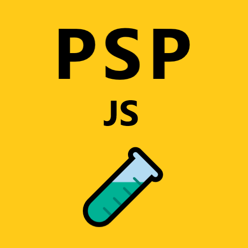

 
<h1 align="left">
 
<b>Hi, I'm pjnalls 🙋🏾‍♂️👨🏾‍💻.</b>
 
</h1>

 

I'm a web developer who dedicates most of their time toward JavaScript development, e.g.,problem-solving algorithms, building full-stack, Angular and .NET web apps, implementing Angular design systems, and creating web pages with pure HTML, CSS, and ES6 JavaScript.

 

Beyond web development, I consider myself a thinker and a life-long learner of many things in the world of computation and society — I consider myself for `AllThings.js`.

> A great specialist is also a good generalist.

👆🏾 I see the importance of general understanding of computation and society in order to truly know the purpose of JavaScript, what it can do, and <em>why</em> it does what it does.

...
 

 

Please feel free to visit my repos and give them a ⭐ if you find any of them useful.

For `Angular` projects, check out <a href="https://github.com/pjnalls/Angularization"><b> Angularization</b></a> and <a href="https://github.com/pjnalls/ng-material-examples"><b> Angular Material Examples</b></a>.
 
For `JavaScript Algorithms`, check out my latest <a href="https://github.com/pjnalls/test-driven-javascript-dsa/blob/main/algorithms/search/a-star.js"><b>`A*` search algorithm, test-driven-developed with JavaScript</b></a>.
 
For `Problem-solving with JavaScript`, check out <a href="https://github.com/pjnalls/ProblemSolvingProgramming.js"> <b>ProblemSolvingProgramming.js</b></a> — a process for completely clarifying any given problem statement to confidently code your solution.

 

 

<!--

-->

 

