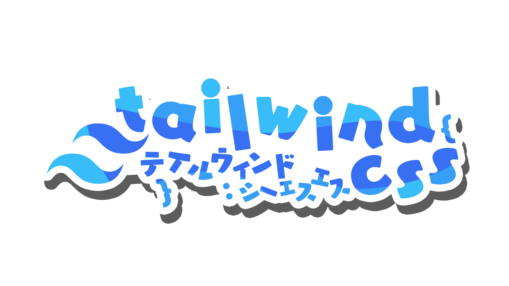
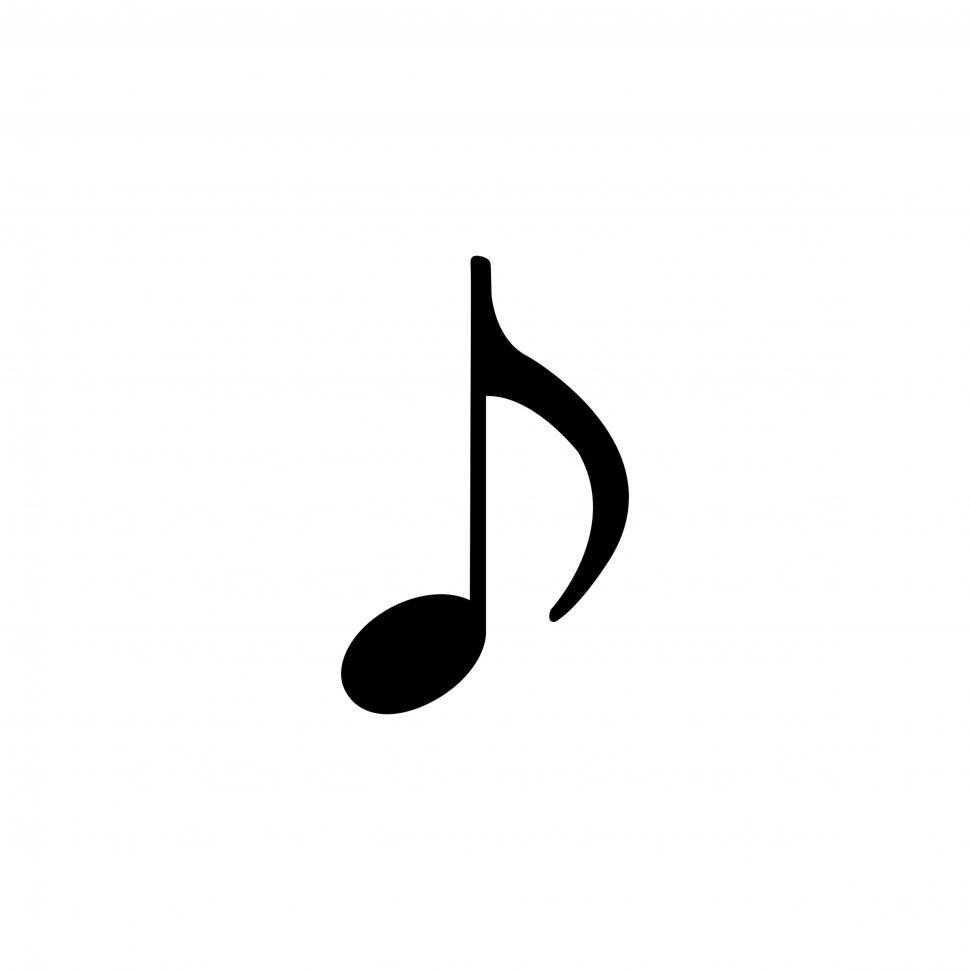

 

<h2>

**🧑‍💻 About me**

</h2>

👷 I have 7+ years of frontend software development experience and am
currently only accepting contracts for React Native but am open to a
postgraduate degree program.

☯️ I'm interested to great depths in all aspects of STEAM (science,
technology, engineering, art, and mathematics). 
Moreover, I consider art in it's both simultaneously novel and useful
forms to be the quantum mechanical medium fundamental to the rigorous
study of nature and the creative process for the greatest discoveries
of the universe.

🧬 In a more practical sense related to STEAM, I'm currently and actively
seeking opportunities to study quantum physics (for science), taking
the time to understand quantum computers and machine learning (for
technology), improving my frontend mobile and web software development
expertise in React Native (for engineering), finding articulate expression
via my second language Japanese and third language Mandarin (for art),
and solving quantum-logical problems with classic logical states on
three-dimensional planes (for mathematics).
 
 

<h2>

**🧮 My Skills**

</h2>

  
  
  
  
  
  
<a href="https://github.com/SAWARATSUKI/KawaiiLogos/blob/main/README_EN.md">KawaiiLogos</a> shown above were made by <a href="https://github.com/SAWARATSUKI">SAWARATSUKI</a>.

 

<h3 align="center">
🧬 Primary Programming Languages
</h3>

-582745?&logo=sass&logoColor=ee87ba>)

<h3 align="center">
🛠️ Frontend and UI/UX Toolkit
</h3>

 

<h3 align="center">
🔤 Natural Languages 
 (Greatest-to-Least Proficiencies) 
</h3>

-801f48>)

-501f58>) 

<h3 align="center">

 

⏱️ Most Used Programming Languages
 (on GitHub@pjnalls)

</h3>

 

<h2 align="left">

**💼 My Projects**

</h2>

 

🖼️ Click an image below to view the code for one of my live projects.

 

  

    
    
    
    
     
  

 
 

<footer>

<i>made with</i>

<h3>
Markdown + Hexadecimal Color Codes + HTML + Piskel and ❤️
</h3>

 

Copyright © 2023, 2024 Preston Nalls

</footer>

 
 
