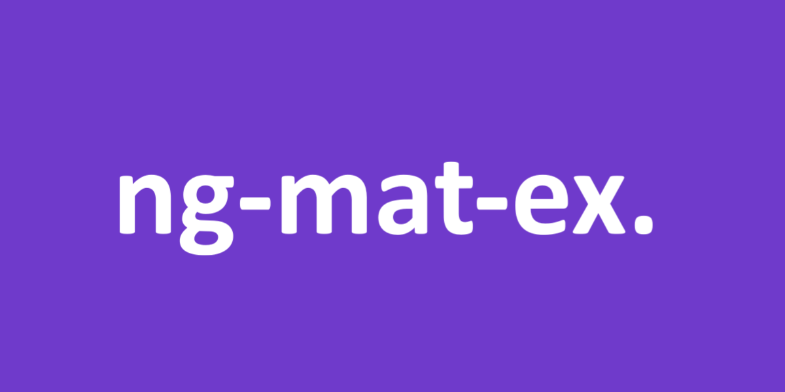

 
<h3 align="center">Hi there 🙋🏾‍♂️.
 
I'm the creator of <a href="https://github.com/pjnalls/Angularization"><b> Angularization</b></a> and <a href="https://github.com/pjnalls/ng-material-examples"><b> Angular Material Examples</b></a>.
  

My latest work is the <a href="https://github.com/pjnalls/test-driven-javascript-dsa/blob/main/algorithms/search/a-star.js"><b>`AStar` algorithm, test-driven-developed with JavaScript</b></a>.

</h3>

 

Check it out all my repositories, and please give them a ⭐ if you find any of them useful.

<!--

-->

 

