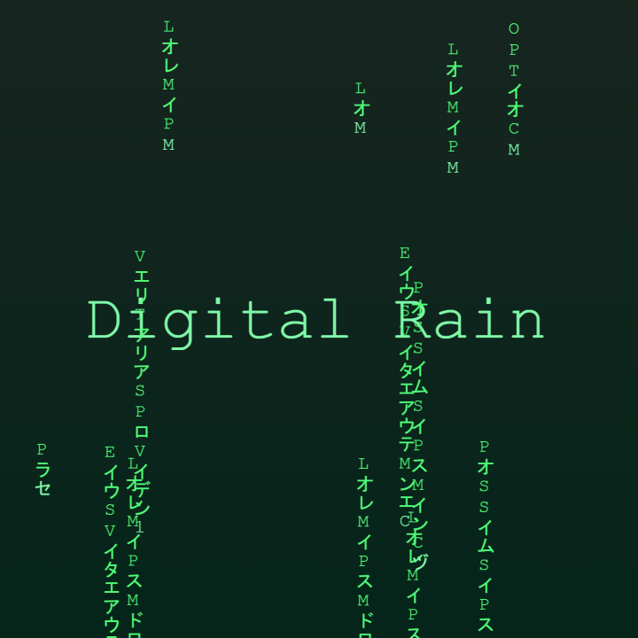
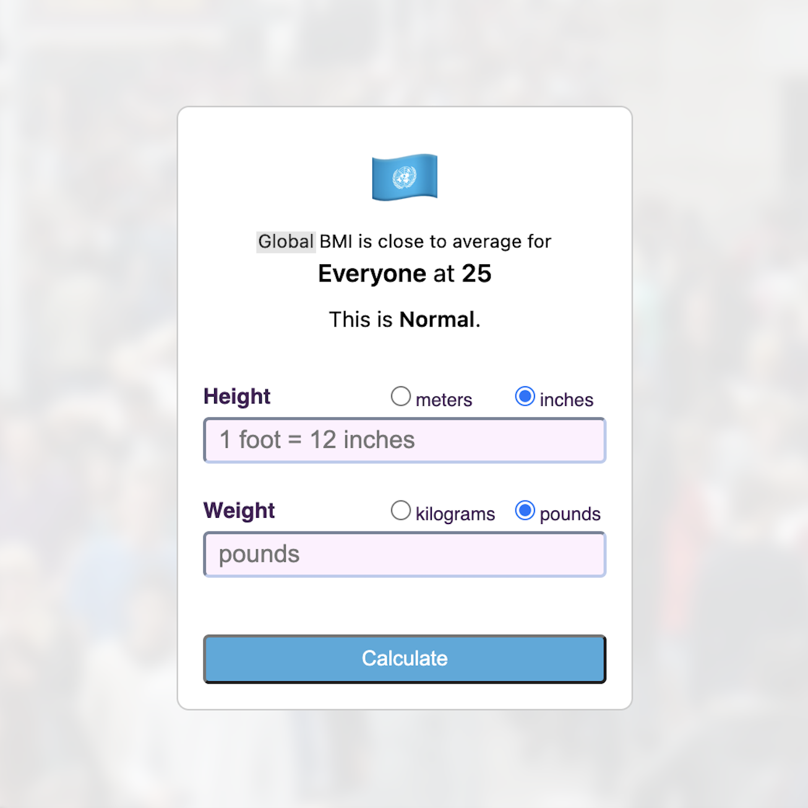
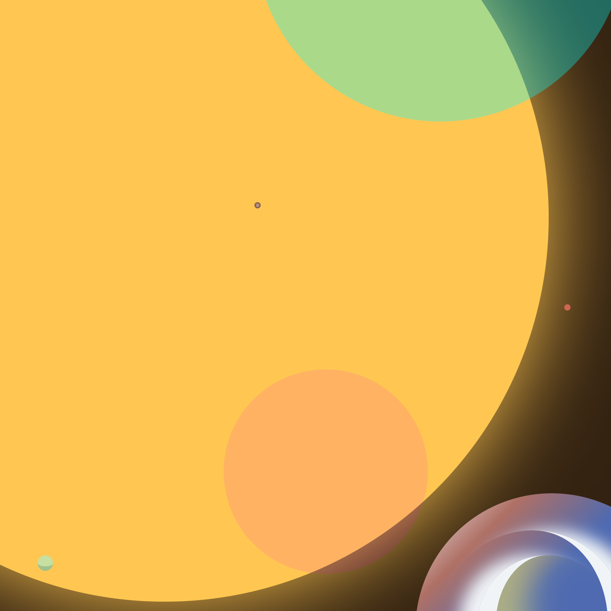

 

<h2>

**🧑‍💻 About me**

</h2>

👨‍💻 I create, enhance, and maintain React, Angular, .NET, and React Native web and mobile apps and services where I work and do extended amounts of yoga in my spare time. 
I primarily write code in either C# and TypeScript, currently learning Python, and can read in multiple natural languages.

🧬 Hopefully through my work, I can inspire others to make their work "human-centered"—as human-computer interaction (HCI) becomes of paramount with advancements in technologies such as artificial general intelligence (AGI), metaverse-user experiences, etc.

<h2>

 

**💼 My Projects**

</h2>

 

🖼️ Click an image below to view one of my live projects.

 

  

    
    
    
    
     
  

<h2>

 

**🧮 My Skills**

</h2>

 

<h3 align="center">
🧬 Primary Programming Languages
</h3>

-582745?style=for-the-badge&logo=sass&logoColor=ee87ba>)

<h3 align="center">
🖼️ UI/UX and Frontend Toolkit
</h3>

   

   

 

<h3 align="center">
🔤 Natural Languages 
 (Greatest-to-Least Proficiencies) 
</h3>

-701f58?style=for-the-badge>)
-501f58?style=for-the-badge>) 

 

---

<h3 align="center">

 

⏱️ Most Used Programming Languages
 (on GitHub@pjnalls)

</h3>

 

 
 

 
 

<footer>

<i>made with</i>

<h3>
Markdown + Hexadecimal Color Codes + HTML + Piskel and ❤️

 

<a href="https://github.com/pjnalls/pjnalls/blob/main/ONELOVE.md"
  target="_blank"
  rel="noopener noreferrer">#onelove</a>
🌏🌍🌎

</h3>

 

Copyright © 2023, 2024 Preston Nalls

</footer>

 
 
