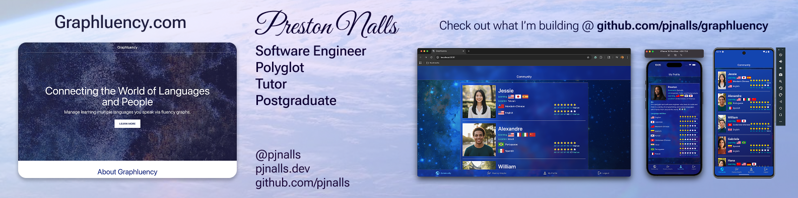
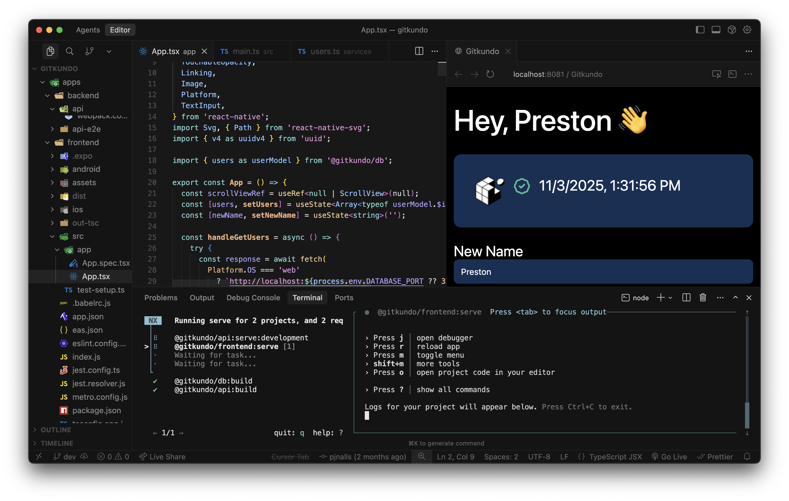

# Hey there! 👋 I'm Preston.

## Here's a bit about me 💁

**💡 Senior Software Engineer (8+ years) teaching full-stack TypeScript mastery.**

I build and create tutorials for modern, cross-platform apps using the ultimate stack: **TypeScript, React, React Native (Expo), Node.js, Express, and modern ORMs/databases.**

Subscribe [here](https://www.youtube.com/@pjnalls) for weekly deep dives, architecture breakdowns, and complete app builds—from pixel-perfect frontend to scalable backend.

*PS: Open to exciting new Frontend & Full-Stack roles! 🚀*

## Here's what I'm currently working on 🏗️

### Nebula AI

Expo & Nativewind, AI-chatbot app written in React Native that I'm building in public on YouTube.

🎥 YouTube playlist of me building the app from start to finish available [here](https://youtube.com/playlist?list=PL9LMfcQwJu49dfQjGwatQv_X_sY2fiWPd&si=k9Fvj5QOjWqAfnMP).

Code available [here](https://github.com/pjnalls/nebula-ai):

### [Graphluency](https://github.com/pjnalls/graphluency)

Connecting the world of languages and people via multilingual fluency graphs on the Web, iOS, and Android.

### [Gitkundo](https://github.com/pjnalls/gitkundo)

An all-in-one, full-stack TypeScript development environment: One language. One integrated terminal. One integrated browser. One repo... All in one window! ✨

## Here are my skills and stats 💪

### Skill Icons 🥇

### GitHub Stats ⚡️

<!-- Leave height for 1st and 2nd images at 164 and 174 px. -->

<footer>

 

Copyright © 2023, 2024, 2025 Preston Nalls

</footer>

