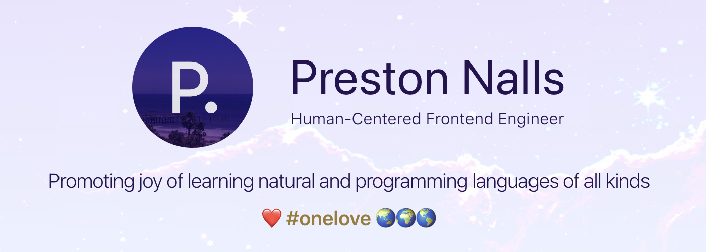

<picture>
  <source media="(prefers-color-scheme: light)" srcset="assets/banner-light.avif">
  <source media="(prefers-color-scheme: dark)" srcset="assets/banner-dark.avif">
  
</picture>

 

 

<h2>

**🧑‍💻 About me**

</h2>

 

🎨 As a frontend engineer by day who takes language-learning seriously, I spend most of my free time learning all kinds of natural languages—in addition to programming languages such as TypeScript and Sass I use just about everyday. 
 
🧬 Hopefully through my work, I can inspire others to make their work "human-centered"—as human-computer interaction (HCI) becomes of paramount importance with advancements of technologies such as artificial general intelligence (AGI), metaverse-user experiences, etc.

<h2>

 

**🧮 My Skills**

</h2>

 

<h3 align="center">
🧬 Primary Programming Languages
</h3>

-582745?style=for-the-badge&logo=sass&logoColor=ee87ba>)

<h3 align="center">
🖼️ UI/UX and Frontend Toolkit
</h3>

   

   

 

 

---

<h3 align="center">

 

⏱️ Most Used Programming Languages
 (on GitHub@pjnalls)

</h3>

 

 
 

 
 

<footer>

<i>made with</i>

<h3>
Markdown + Hexadecimal Color Codes + HTML + Piskel and ❤️

 

<a href="https://github.com/pjnalls/pjnalls/blob/main/ONELOVE.md"
  target="_blank"
  rel="noopener noreferrer">#onelove</a>
🌏🌍🌎

</h3>

 

Copyright © 2023, 2024 Preston Nalls

</footer>

 
 
