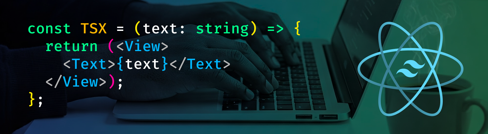

 

<h2>

**🧑‍💻 About me**

</h2>

I'm a Master of Science in Information Technology postgraduate at the University of the People (MS in IT @ University of the People) 📚.

Once I graduate, I'd like to be a Master of Science in Computer Science postgraduate with a Specialization in Machine Learning at Georgia Institute of Technology (MS in CS, Specialization in ML @ Georgia Tech) ✨.

I'm also a software engineer with 8+ years of frontend development experience and a tutor by profession. I primarily write code in React Native, NativeWind, and TypeScript, building and teaching people and AI how to build cross-platform Expo apps for iOS, Android, and the Web 📲.

When I'm not studying or coding, I spend most of my free time in introspection 🧘, cooking 🍳, and listening to a ton of video game music 👾.

Ultimately, I'm pursuing MS degrees in both IT and CS because 1️⃣ UoPeople and Georgia Tech have the most affordable graduate degree programs (as far as I know), and 2️⃣ I believe this is *the* time to upskill for the AI revolution 🤖.
<h2>

**🧮 My Skills**

</h2>

  
  
  
  
  
  
<a href="https://github.com/SAWARATSUKI/KawaiiLogos/blob/main/README_EN.md">KawaiiLogos</a> shown above were made by <a href="https://github.com/SAWARATSUKI">SAWARATSUKI</a>.

<h3 align="center">
🧬 Primary Programming Language
</h3>

<h3 align="center">
🛠️ Software Engineering Toolkit
</h3>

<h3 align="center">
🔤 Natural Languages 
 (Greatest-to-Least Proficiencies) 
</h3>

-701f58>)
-501f58>) 

<h3 align="center">

⏱️ Most Used Programming Languages
 (on GitHub@pjnalls)

</h3>

<h2 align="left">

**💼 My Projects**

</h2>

 

🖼️ Click an image below to view the code for one of my live projects.

 

  

    
    
     
  

 
 

<footer>

<h3>❤️ <a href="/ONELOVE.md">#ONELOVE</a> 🌏🌍🌎</h3>

<i>made with</i>

<h3>
Markdown + HTML + Hexadecimal Color Codes and ❤️
</h3>

 

Copyright © 2023, 2024, 2025 Preston Nalls

</footer>

 
 
